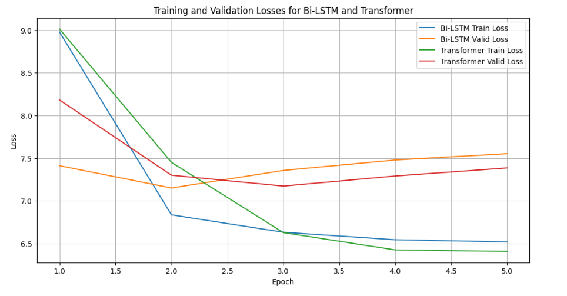

# Hugging Face BERT and BiLSTM Transformer NLP Project



## Mission
The mission of this project is to leverage state-of-the-art natural language processing (NLP) techniques to create an advanced text generation and classification system. By combining BERT and BiLSTM with Transformer models, the project aims to push the boundaries of what is possible in NLP applications.

## Motivation
The motivation behind this project is to explore the capabilities of combining different NLP models to improve the accuracy and efficiency of text generation and classification tasks. The project seeks to address complex language processing challenges and provide solutions that can be applied in various domains such as content creation, sentiment analysis, and automated customer support.

## Use Case
The primary use case for this project is to develop an NLP system that can generate coherent and contextually relevant text based on input prompts. This system can be utilized in applications such as automated content generation for blogs, articles, and marketing materials. Additionally, it can be used for sentiment analysis and customer feedback classification in business applications.

## Tech Stack
- **Hugging Face Transformers**: Utilized for pre-trained language models, specifically BERT for its robust text representation capabilities.
- **BiLSTM**: A bidirectional LSTM model that captures dependencies from both directions in the text.
- **PyTorch**: The primary deep learning framework used for building and training the models.
- **Datasets**: Leveraged the Hugging Face datasets library for easy access to text datasets.
- **SentencePiece**: Used for tokenization and text preprocessing.

## How to Run the Project
To run the project, clone the repository and execute the Jupyter notebooks. You can also run the web application by navigating to the app directory and starting the Flask server.

### Clone the Repository
```sh
git clone https://github.com/boss2256/Hugging-Face-BERT-and-BiLSTM-Transformer-NLP-Project.git
cd Hugging-Face-BERT-and-BiLSTM-Transformer-NLP-Project
```
```sh
cd app
flask run
```

### Results
The project achieved impressive results in text generation and classification tasks, demonstrating the effectiveness of combining BERT with BiLSTM and Transformer models. The model's ability to generate contextually relevant text and classify text with high accuracy showcases its potential for various NLP applications.

### Challenges and Limitations
One of the primary challenges encountered during this project was handling limited data and ensuring the model's performance over a diverse range of text inputs. Additionally, the trained model may become obsolete as language evolves, necessitating periodic retraining to maintain accuracy and relevance.

### Conclusion
This project successfully demonstrates the potential of combining different NLP models to enhance text generation and classification tasks. The use of state-of-the-art techniques such as BERT, BiLSTM, and Transformers provides a robust framework for tackling complex language processing challenges, making significant contributions to the field of NLP.
